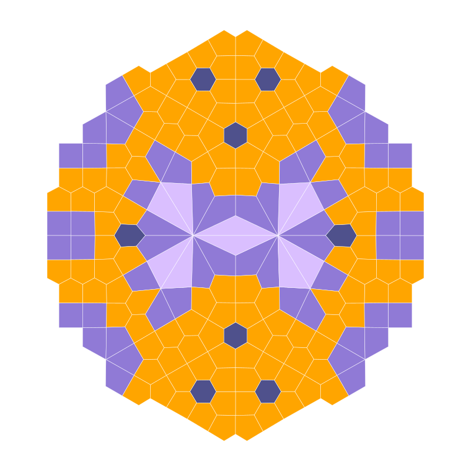
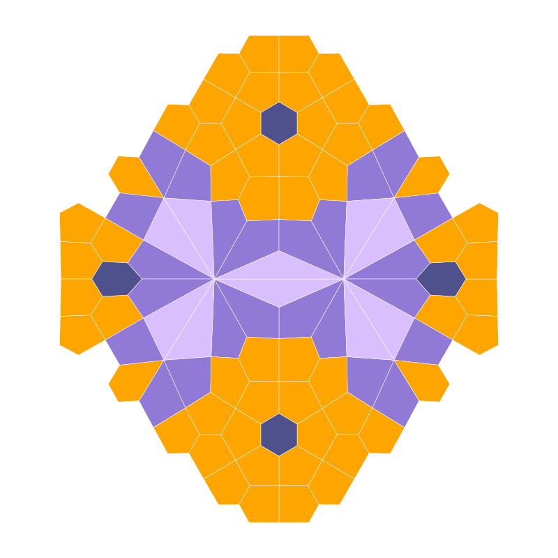
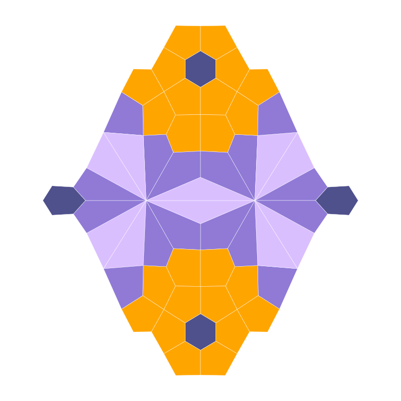
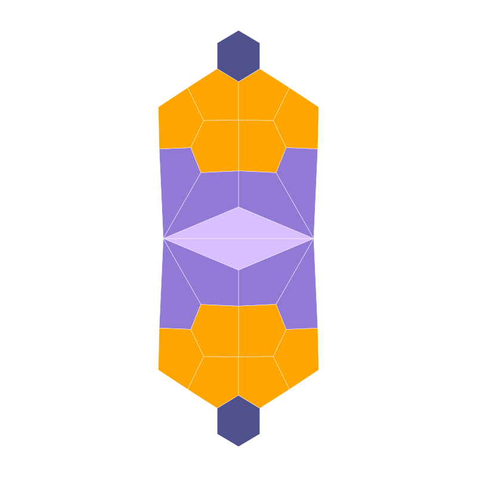

# Tiling of the Plane with Regular Polygons

This repository features a unique tiling of the plane with regular polygons, showcasing all vertex types except for the 4-8-8 configuration. Special thanks to Samy Meziane for providing this remarkable example.

## Visualizing the Tiling and Its Duals

### Original Tiling

Below is the original tiling of the plane with regular polygons:

### Dual Tiling

The dual tiling of the original configuration:

### Bidual Tiling

The bidual tiling (dual of the dual):

### Tridual Tiling

The tridual tiling (third dual):

### Quadrial Tiling

The quadrial tiling (fourth dual):

### Higher-Order Dual Tilings

The process of deriving duals can be repeated indefinitely. Below are the visualizations up to the 15th-order dual:

#### Fifth Dual Tiling

#### Sixth Dual Tiling

#### Seventh Dual Tiling

#### Eighth Dual Tiling

#### Ninth Dual Tiling

#### Tenth Dual Tiling

#### Eleventh Dual Tiling

#### Twelfth Dual Tiling

#### Thirteenth Dual Tiling

#### Fourteenth Dual Tiling

#### Fifteenth Dual Tiling

## Acknowledgments

Special thanks to Samy Meziane for his contribution to this fascinating exploration of planar tilings.
