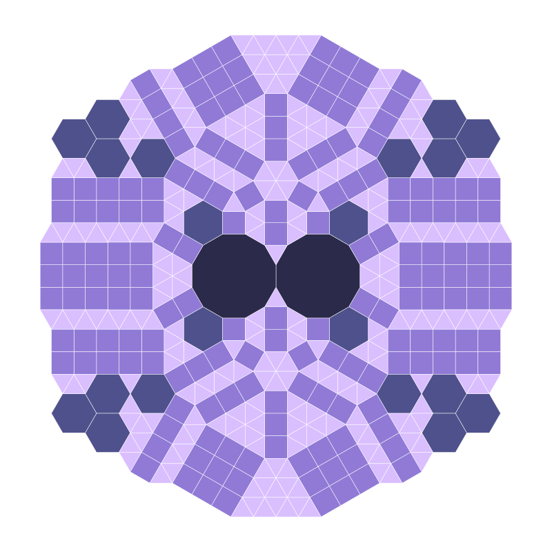
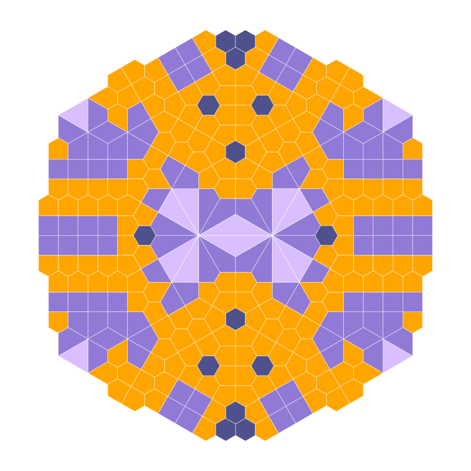
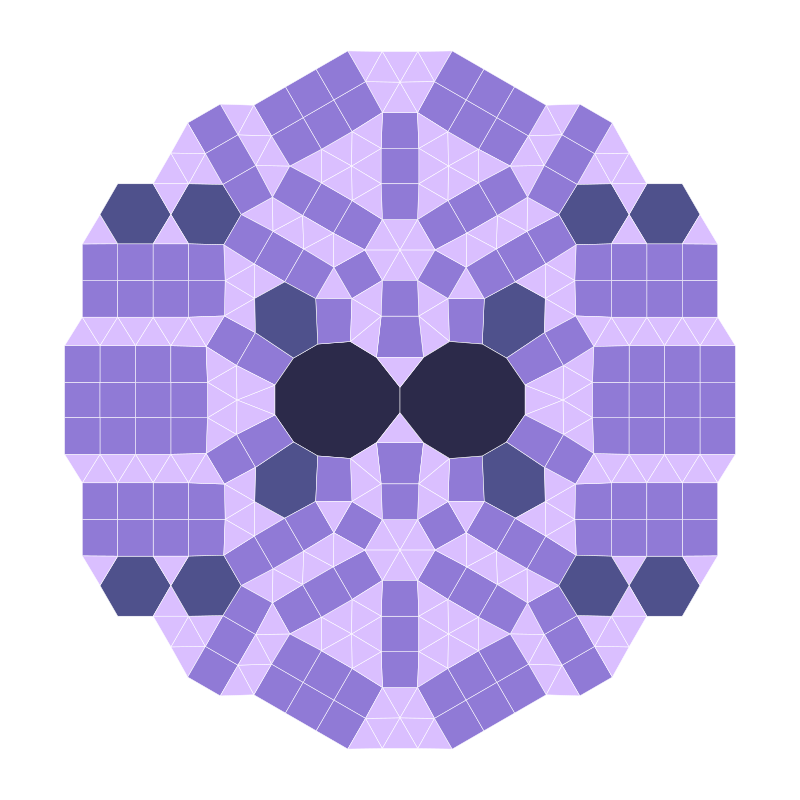
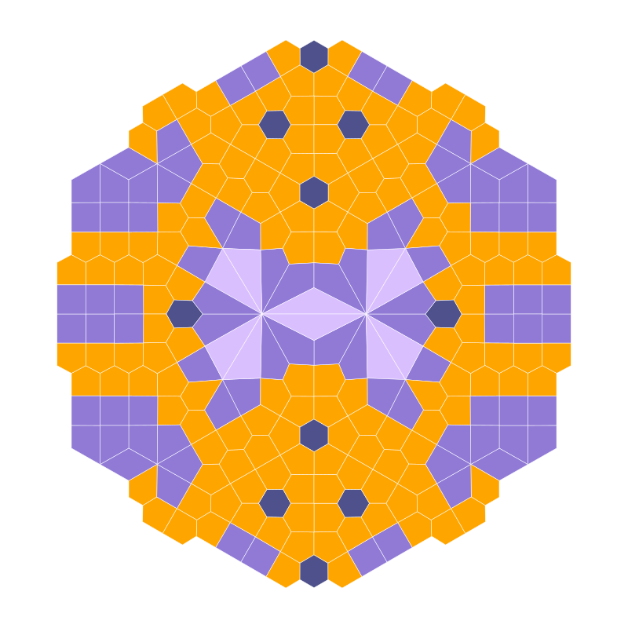
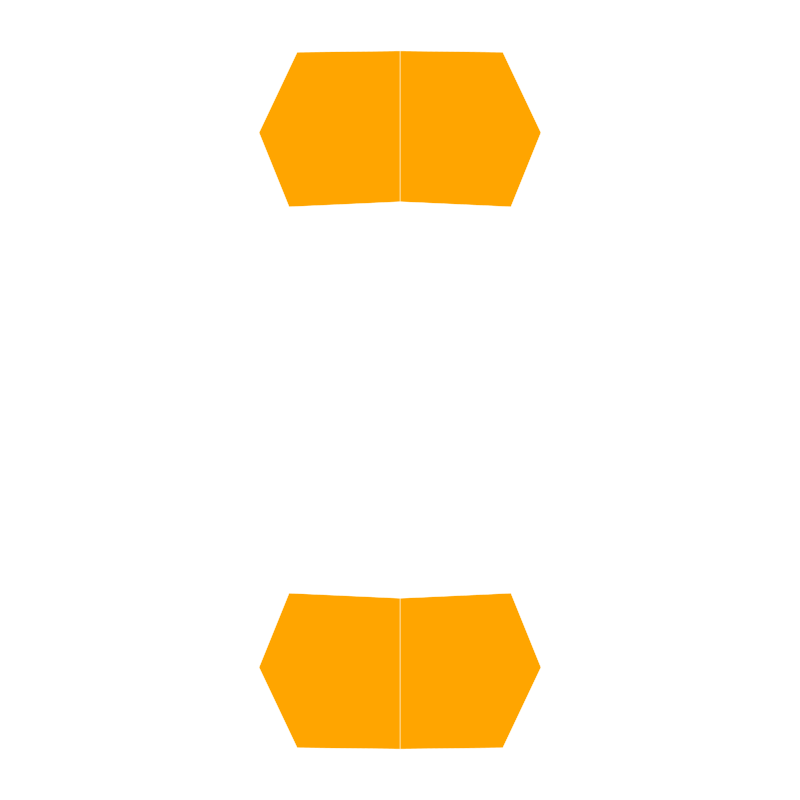

The following is a tiling of the plane with regular polygons featuring all vertex types, except for the 4-8-8. Thanks to Samy Meziane for providing this example.

and below its dual tiling:

and below its bidual tiling:

and below its tridual tiling:

and below its quadrial tiling:

... and its 15th dual tiling:

